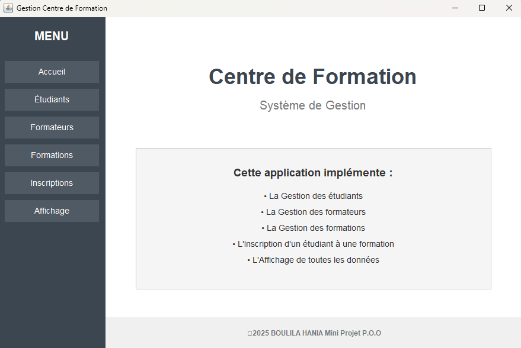
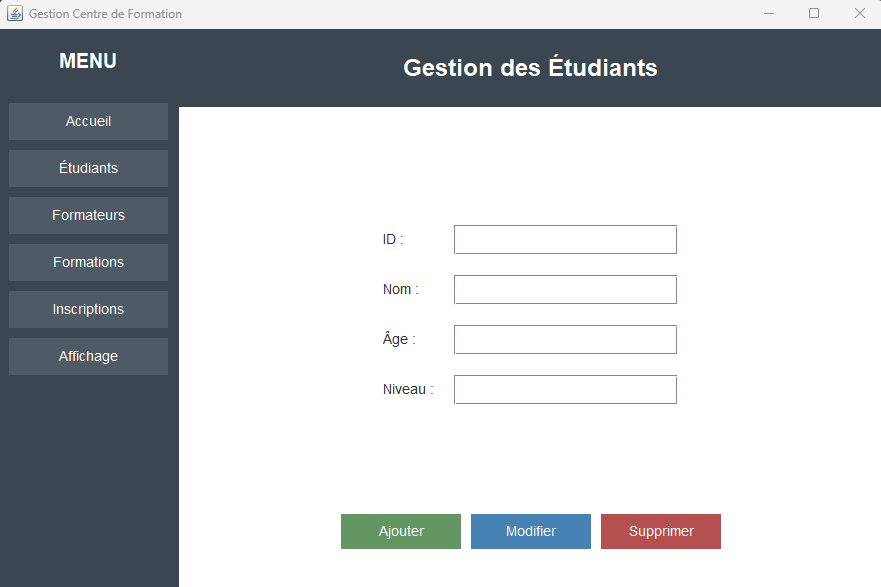
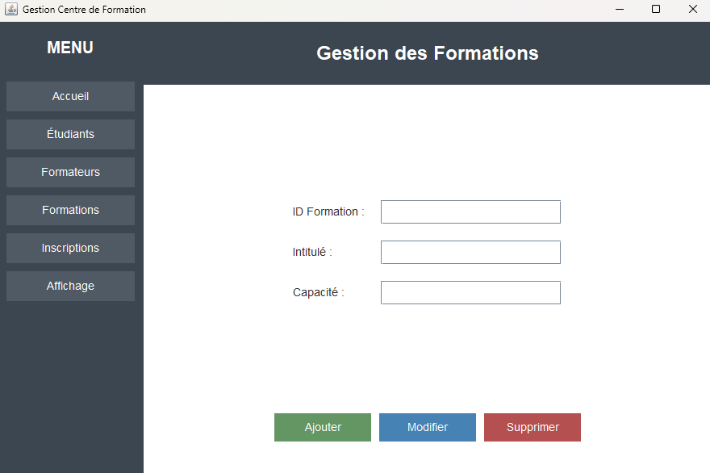
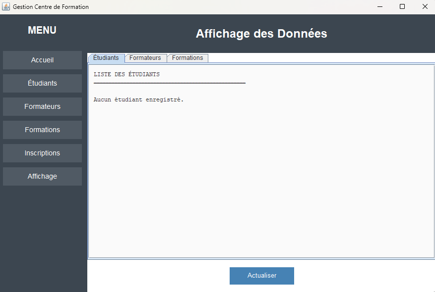

# Gestion Centre de Formation

Un projet Java de gestion d'un centre de formation développé dans le cadre d'un TP académique.

## Description

Application de gestion complète pour un centre de formation permettant de gérer les étudiants, les formateurs, les formations et les inscriptions. Le projet inclut une interface graphique développée avec Java Swing.

## Fonctionnalités

- **Gestion des étudiants** : Ajout, modification et consultation des informations
- **Gestion des formateurs** : Administration des formateurs et leurs spécialités
- **Gestion des formations** : Création et organisation des formations
- **Gestion des inscriptions** : Inscription des étudiants aux formations
- **Affichage des données**
- **Interface graphique Swing**
- **Exécution en console ou GUI**

## Technologies utilisées

**Langage** : Java

**Interface graphique** : Swing

**Build** : JAR exécutable


## Installation et utilisation

### Prérequis

 Java JDK 8 ou supérieur installé sur votre machine

### Exécution du fichier JAR

```bash
java -jar CentreFormation.jar
```

## Aperçu
<div align="center">
  
  
</div>
<div align="center">
  
  
</div>

## Notes

- **Projet académique** : C'est un projet académique réalisé dans le cadre d'un travail pratique universitaire
- **Pas de base de données** : Les données sont gérées en mémoire (non persistantes)
- **Objectif pédagogique** : Démonstration des concepts de POO et développement d'interfaces graphiques en Java

## Améliorations futures possibles

- Intégration d'une base de données (MySQL, PostgreSQL)
- Persistance des données (sérialisation ou fichiers)
- Système d'authentification
- Export des données (PDF, Excel)
- Recherche et filtrage avancés
=======
